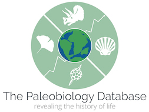

## Fossil Hunting

### My problem
I want a list of the top 20 fossils I might find in a given location.  In more detail, I went on vacation in Texas and wanted to go fossil hunting, but since most of my fossil hunting experience was from the southern coast of England, I wasn't sure what to look for.  They must have different fossils in Texas, right?

### My answer
If I had a list of fossils from around the world (along with where they were found), I could just filter it by location, aggregate by scientific name, and sort it by count.  I'd end up with a sorted list of the most common fossils found in that location.

So, I need the data and I need a bit of filtering, aggregation, and sorting.  Here's how it came together.

### The data

The stunningly useful [Paleobiology Database](https://paleobiodb.org/) allows you to download a list of fossils that reside in museum collections with information about where they were found.

**The data were downloaded from the Paleobiology Database on 28 February, 2021, choosing 'specimens' and the following parameters: cc = ATA,AFR,ASI,AUS,EUR,IOC,NOA,OCE,SOA**

The database records have taxonomic classifications from which I choose to use: 
1. genus
2. accepted_name. 

The location data includes the following fields which I found useful:
1. latitude
2. longitude
3. state
4. county

#### But I want more data
I would find it convenient to select my geographic region by first specifying a country, then a state/province, then a county.  However, the dataset doesn't include a country feature.  I'll have to add that.  Luckily the [geopy](https://pypi.org/project/geopy/) library can do that for me given the lat/lng pairs that I have for each record.

### Preprocessing the data
Actually, geocoding is a fairly computationally expensive task.  To mitigate that, I do it in two steps.  First, I identify the unique latitude/longitude pairs and geocode those.  There are about ten times fewer unique pairs than records in the dataset.  So, that drops geocoding expenses to around 1/10th of what they would have been.

I store those geocoded lat/lng pairs in a dictionary which can do quick lookups (thanks HashTable data structure!).  Then, I create the new "country" column in the dataset and lookup its value for each record from the dictionary.

I also save the geocoded lat/lng pairs and the finished dataframe (with the country column) so I don't have to redo these geocoding tasks.

### Using the script
All that preprocessing leads to the script that I care most about (i.e., the one where I get my list of fossils).  It is called List_Top_Fossils_in_Area.ipynb.  It's a Jupyter notebook script.  To use it...

1. Launch Jupyter
2. Open the List_Top_Fossils_in_Area.ipynb script
3. Click Run --> Run all cells
4. Scroll down to the bottom and you'll see some dropdown widgets
5. Use the widgets to pick the country, state, and county in which you are intereseted
6. See the list of fossils appear in the following cell's output!

### Caveats
1. **The data is as clean and complete as it stands in the Paleobiology Database**
Rather than clean up the data "downstream" (i.e., as part of this project) we will be working with the Paleobiology Database to help them improve their already excellent resource.  We will follow their recommended procedures from:
[What should I do if I spot an error in the database?](https://paleobiodb.org/#/faq/what-should-i-do-if-i-spot-an-error-in-the-database-)
and
[How do I report bugs?](https://paleobiodb.org/#/faq/how-do-i-report-bugs-)

2. **Only professional quality fossils are represented**
The fossils in this database may not represent what you and I find (or find most frequently) in the field.  The fossils in the [Paleobiology Database](https://paleobiodb.org/) are those that made it into museums, collections, and/or are mentioned in scientific publications.

